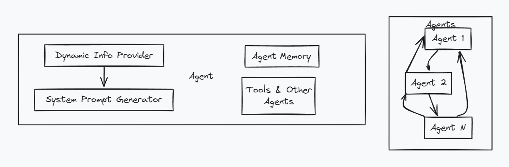

# Atomic Agents

Atomic Agents is a lightweight Python framework for building LLM apps with typed,
structured input and output. It layers on [Instructor](https://python.useinstructor.com)
and Pydantic v2, so every interaction between user, agent, tool, and context is a
validated schema. This skill orients you on the framework and routes to focused
reference files under `references/` as the task requires.



## Core abstractions

| Concept | Class | Role |
|---|---|---|
| Schema | `BaseIOSchema` | Typed input/output contract — every agent/tool I/O is one |
| Agent | `AtomicAgent[In, Out]` | LLM-backed transformer from input schema to output schema |
| Config | `AgentConfig` | Wires client, model, history, prompt, roles, API params |
| Prompt | `SystemPromptGenerator` | Three-section prompt: background, steps, output_instructions |
| History | `ChatHistory` | Conversation state, serializable, token-counted |
| Tool | `BaseTool[In, Out]` | Deterministic capability the agent can invoke |
| Context | `BaseDynamicContextProvider` | Dynamic section injected into the system prompt at runtime |

All communication uses `BaseIOSchema` subclasses with **docstring-required** descriptions.

## Canonical imports

```python
from atomic_agents import (
    AtomicAgent, AgentConfig,
    BasicChatInputSchema, BasicChatOutputSchema,
    BaseIOSchema, BaseTool, BaseToolConfig,
)
from atomic_agents.context import (
    ChatHistory, Message,
    SystemPromptGenerator, BaseDynamicContextProvider,
)
# Optional: MCP interop
from atomic_agents.connectors.mcp import fetch_mcp_tools, MCPTransportType
```

Do not use legacy paths like `atomic_agents.lib.base.*` or `atomic_agents.agents.base_agent` — retired. Import from the top-level package.

## Minimum viable agent

This repo standardizes on **Anthropic** — you only need `ANTHROPIC_API_KEY` (no OpenAI key).

```python
import os, instructor
from anthropic import Anthropic
from atomic_agents import AtomicAgent, AgentConfig, BasicChatInputSchema, BasicChatOutputSchema
from atomic_agents.context import ChatHistory

client = instructor.from_anthropic(Anthropic(api_key=os.environ["ANTHROPIC_API_KEY"]))

agent = AtomicAgent[BasicChatInputSchema, BasicChatOutputSchema](
    config=AgentConfig(
        client=client,
        model="claude-sonnet-4-6",
        history=ChatHistory(),
        model_api_parameters={"max_tokens": 1024},   # Anthropic requires max_tokens
    )
)

reply = agent.run(BasicChatInputSchema(chat_message="Hello"))
print(reply.chat_message)
```

`AtomicAgent` and `BaseTool` use PEP 695 generics — the type parameters carry runtime
information, so write them explicitly. The repo's `atomic-examples/quickstart/` defaults to
OpenAI; swap the client to `instructor.from_anthropic(...)` as above to run it Anthropic-only.

## Two models in parallel (Opus leader + Sonnet workers)

`AgentConfig` is provider/model-agnostic: each agent owns its own `client` + `model`,
so you can run a **strong leader** and several **fast workers** at the same time. This
mirrors the repo's Claude Code orchestration squad (Opus 4.7 leader, Sonnet 4.6 workers
— see the sibling `orchestrate` skill and `.claude/agents/`).

```python
import os, asyncio, instructor
from anthropic import AsyncAnthropic
from atomic_agents import AtomicAgent, AgentConfig

aclient = instructor.from_anthropic(AsyncAnthropic(api_key=os.environ["ANTHROPIC_API_KEY"]))

# Workers — fan out in parallel
worker = lambda: AtomicAgent[WorkerIn, WorkerOut](
    config=AgentConfig(client=aclient, model="claude-sonnet-4-6",
                       model_api_parameters={"max_tokens": 2048}))
# Strong leader — synthesizes once workers return
leader = AtomicAgent[LeaderIn, LeaderOut](
    config=AgentConfig(client=aclient, model="claude-opus-4-7",
                       model_api_parameters={"max_tokens": 4096}))

async def run(tasks):
    results = await asyncio.gather(*[worker().run_async(t) for t in tasks])
    return await leader.run_async(LeaderIn(parts=[r for r in results]))
```

Give every concurrent agent its **own** `ChatHistory` (or none) — sharing one across
parallel runs corrupts state. Full pattern in [references/parallel-models.md](references/parallel-models.md).

## Setup & run

The framework is real and on PyPI (`atomic-agents`, this repo is v2.7.x). To run it:

1. **Python 3.12+** — required (PEP 695 generics). This repo is a `uv` workspace, so use
   `uv` rather than the system interpreter (which may be 3.11).
2. **Install** — in the repo: `uv sync`. Standalone:
   `pip install "atomic-agents>=2.7" "instructor[anthropic]"`.
3. **Key** — the framework reads `$ANTHROPIC_API_KEY` from the environment (Anthropic-only,
   no OpenAI key). Provide it as an environment secret — never hardcode or paste a key value.
4. **Run** — `uv run python your_script.py`, using the Anthropic snippets above.
5. **Models** — leader `claude-opus-4-7`, workers `claude-sonnet-4-6`. Anthropic requires
   `max_tokens` in `model_api_parameters` on every call.

Constructing an `AtomicAgent`/`AgentConfig` is offline; only `.run()`/`.run_async()` hit
the API, so a live call needs the key set.

## Decision routing

Load the reference file that matches the task; each is read only when needed.

| Task | Reference |
|---|---|
| Design or validate an input/output schema | [references/schemas.md](references/schemas.md) |
| Build, configure, or run an agent | [references/agents.md](references/agents.md) |
| Write a tool the agent will invoke | [references/tools.md](references/tools.md) |
| Inject dynamic data into the system prompt | [references/context-providers.md](references/context-providers.md) |
| Coordinate multiple agents | [references/orchestration.md](references/orchestration.md) |
| Run a leader + workers across models | [references/parallel-models.md](references/parallel-models.md) |
| Swap LLM provider or configure roles | [references/providers.md](references/providers.md) |
| Runnable examples in this repo | [examples/index.md](examples/index.md) |

For the four most common authoring tasks, the plugin skills under
`claude-plugin/atomic-agents/skills/` (`create-atomic-schema`, `create-atomic-agent`,
`create-atomic-tool`, `create-atomic-context-provider`) give step-by-step workflows.

## Working style

- **Schemas are the contract.** Design the `BaseIOSchema` pair before the agent. Field
  descriptions flow into the prompt via Instructor; every subclass needs a non-empty docstring.
- **System prompts have three sections.** `SystemPromptGenerator(background=, steps=, output_instructions=)`.
- **Wrap the provider client with Instructor.** Always (`instructor.from_openai/anthropic/genai`).
- **Provider knobs go in `model_api_parameters`.** `temperature`, `max_tokens`, `reasoning_effort`.
- **Errors/retries flow through hooks.** Register `parse:error`, `completion:error`, `completion:last_attempt`.

## Anti-patterns

- Plain `BaseModel` instead of `BaseIOSchema`; missing docstrings (framework raises at import).
- `Field(...)` without `description=` — Instructor leans on descriptions.
- Raw provider client passed as `AgentConfig.client` (must be Instructor-wrapped).
- Hardcoded API keys; unbounded `ChatHistory` on long sessions.
- Sharing one `ChatHistory` across parallel agents.
- `MCPTransportType.STREAMABLE_HTTP` — correct value is `HTTP_STREAM`.
